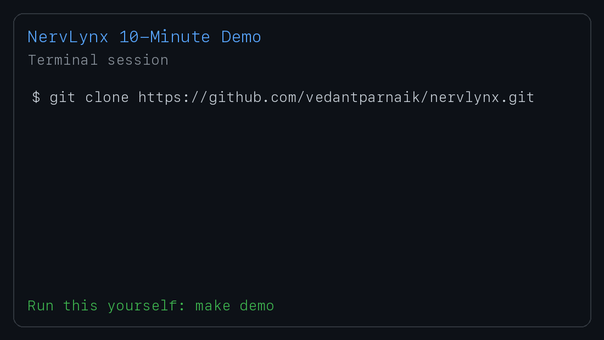

# NervLynx

[](#quick-start-10-minute-path)
[](docs/GETTING_STARTED.md)

NervLynx is an open, modular robotics runtime framework for building reliable and observable robot pipelines.
It helps teams move from ad-hoc prototype scripts to production-style architecture with typed contracts, lifecycle control, traceability, and repeatable validation.

## Demo



## Why NervLynx

- **Structured runtime**: deterministic and async execution modes with priority scheduling
- **Traceable dataflow**: envelope metadata (`topic`, `source`, `sequence`, `timestamp`, `schema`, `trace_id`)
- **Operational safety**: watchdog liveness checks, backpressure detection, startup dependency supervision, checkpoint recovery
- **Extensibility**: plugin SDK, entry-point discovery, and config-driven graph wiring
- **Observability first**: replayable traces, latency/flow stats, Prometheus-style metrics, and runtime dashboard endpoints
- **Deployment ready**: Python and C++ runtimes, CI workflows, deploy profiles, and edge install/config sync scripts
- **Security-ready baseline**: payload signing and topic access policy checks

## Architecture At A Glance

```text
Sensor Ingest -> Perception/Fusion -> Planning -> Actuation -> Uplink/Alerts
```

Primary modules:
- `robot_core`: reusable runtime primitives and CLI
- `shuttle`: reference fixed-route stack built on the same patterns

## Quick Start (10-Minute Path)

```bash
make demo
```

`make demo` creates a local virtualenv, installs dependencies, runs a baseline runtime demo, and replays the produced trace.

If you prefer manual setup:

```bash
python3 -m venv .venv
source .venv/bin/activate
pip install -U pip
pip install -e ".[dev]"
robot-core run-example --output logs/robot_core_trace.jsonl
robot-core replay logs/robot_core_trace.jsonl
```

## Quick Start by Persona

- **Robotics engineer**: run + inspect dataflow quickly (`make demo` then `robot-core inspect-trace ...`)
- **Platform engineer**: bootstrap environment and validate baseline checks (`make setup`, `pytest -q`)
- **Student / hobbyist**: run the easiest happy-path, then try smoke + replay loops

Detailed paths: `docs/GETTING_STARTED.md`.

## Production Confidence

- Compatibility and support tiers: `docs/SUPPORT_MATRIX.md`
- Release benchmark baselines: `benchmarks/baselines/`
- Deterministic replay fixture for CI: `tests/fixtures/replay/`

## Common Commands

```bash
# Basic runtime demo
robot-core run-example --output logs/robot_core_trace.jsonl
robot-core replay logs/robot_core_trace.jsonl

# Surveillance smoke and failure matrix
robot-core smoke-surveillance --output logs/smoke_surveillance_trace.jsonl
robot-core smoke-matrix --output-dir logs/smoke_matrix

# Trace and contracts tooling
robot-core inspect-trace logs/smoke_surveillance_trace.jsonl
robot-core contracts-check
robot-core chaos-pass --drop-probability 0.2 --mutate-probability 0.2

# Supervisor and metrics demos
robot-core supervisor-demo
robot-core serve-metrics --duration-s 5 --port 9108
robot-core dashboard-demo --duration-s 5 --port 9120

# Config-driven graph run
robot-core run-graph deploy/config/graph_surveillance.yaml --output logs/graph_trace.jsonl

# Distributed node mode over transport (local demo)
robot-core distributed-demo

# Checkpoint persistence demo
robot-core checkpoint-demo --node-name planner
```

## C++ Runtime Smoke Test

```bash
cmake -S cpp_core -B cpp_core/build
cmake --build cpp_core/build
./cpp_core/build/smoke_surveillance
ctest --test-dir cpp_core/build --output-on-failure
```

## Validation

```bash
pytest -q
python benchmarks/benchmark_runtime.py
```

CI executes Python tests, smoke matrix, contracts checks, graph run, and C++ build/smoke checks on push and pull requests.

## Repository Layout

- `robot_core/`: core runtime, contracts, transport, observability, metrics, CLI
- `cpp_core/`: C++ runtime reference implementation and smoke executable
- `shuttle/`: reference application stack
- `tests/`: Python unit and integration smoke tests
- `deploy/`: deployment profiles (`systemd`, `docker`, config`)
- `deploy/scripts/`: edge install and config sync scripts
- `examples/robot_packs/`: reusable robot profile graph configs
- `benchmarks/`: runtime performance benchmarks
- `.github/workflows/`: CI pipeline definitions
- `.github/ISSUE_TEMPLATE/`: bug/feature templates for contributors
- `docs/`: architecture and design notes
- `ROADMAP.md`: v0.2 milestones and good-first-issues

## Extending For Your Robot

1. Add sensor adapters and normalize payloads.
2. Define/validate topic contracts with field types.
3. Implement node plugins and wire graphs via YAML.
4. Set watchdog and supervisor policies for your runtime.
5. Enable trace recording and replay in all test environments.
6. Export metrics to your monitoring platform.
7. Use checkpoints for recovery and run chaos/benchmark passes regularly.

## Deployment Shortcuts

```bash
# One-command edge install (target defaults to /opt/nervlynx)
bash deploy/scripts/install_edge.sh

# Sync graph config to a target directory
python deploy/scripts/sync_config.py deploy/config/graph_surveillance.yaml /tmp/nervlynx-config
```

## Project Scope 

NervLynx is a robust runtime foundation, not a complete end-product autonomy system.
Production deployment decisions (safety, compliance, networking, and hardware integration) should be validated for your operational environment.
