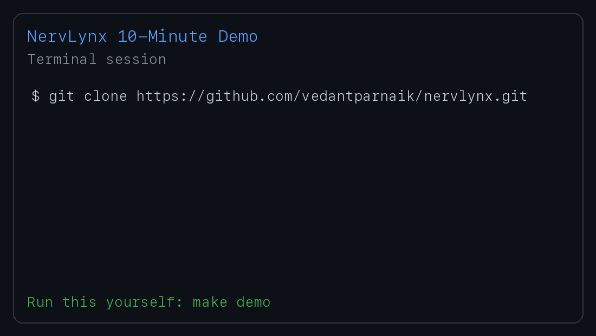

# NervLynx

[](#build-a-robot-in-5-minutes)
[](docs/GETTING_STARTED.md)
[](https://github.com/vedantparnaik/nervlynx/actions/workflows/ci.yml)

NervLynx is a lightweight robot runtime for Raspberry Pi-class boards. Write your robot's
behaviour as plain Python functions, try it in a simulator on your laptop, then run the
same project on the robot, with motor safety, a phone-friendly dashboard, and a report of
every run built in. No ROS required, and nothing to compile on a Pi Zero 2 W.

## Build a robot in 5 minutes

```bash
python3 -m venv .venv && source .venv/bin/activate
pip install "git+https://github.com/vedantparnaik/nervlynx"
nervlynx new my-rover            # or: --template teleop  (see: nervlynx new --list)
cd my-rover
nervlynx sim                     # open http://127.0.0.1:9120/
```

The obstacle-avoider template drives a simulated two-wheel robot around a room with a
distance sensor; the dashboard draws the room, the robot, and what its sensor sees.
Change the behaviour in `nodes/avoid.py`: it is an ordinary function.

```python
from nervlynx import node


@node(inputs=["range.front"], outputs="cmd.drive", rate_hz=20)
def avoid(front, *, stop_m=0.4):
  if front["distance_m"] < stop_m:
    return {"linear": 0.0, "angular": 0.6}
  return {"linear": 0.45, "angular": 0.0}
```

`nervlynx sim --fast --duration-s 60 --strict` runs a repeatable simulated minute and fails
if the robot hits anything, which makes a good test.

## Put it on a Raspberry Pi

On the Pi (Raspberry Pi OS Bookworm; Pi 5, Pi 4, and Zero 2 W), one command installs the
GPIO, I2C, and camera libraries, a virtualenv that can use them, and NervLynx, then runs
`nervlynx doctor` (details and options in [deploy/pi/README.md](deploy/pi/README.md); a
ready-made SD card image is built by the `pi-image` workflow):

```bash
curl -fsSL https://raw.githubusercontent.com/vedantparnaik/nervlynx/main/deploy/pi/install.sh | bash
nervlynx scan                    # finds sensors and suggests nodes
```

Wire it as the project's `README.md` shows, then from your laptop:

```bash
nervlynx deploy pi@my-rover.local --remote-nervlynx '~/.venv/bin/nervlynx' --service
```

That copies the project, checks it on the robot, and starts it (and at every boot, and
again if it ever freezes). The dashboard is at `http://my-rover.local:9120/` from your
phone. `nervlynx logs` follows it; `nervlynx pull` brings recorded runs back to the
laptop. Or run it by hand on the Pi with `nervlynx run` (add `--control` to drive from
the dashboard).

The same `robot.yaml` runs in both places: `hardware.backend: auto` uses real pins on the
Pi and mock pins elsewhere, and nodes marked `only: sim` or `only: robot` (the simulated
room, the real distance sensor) run only where they belong. The dashboard's **Calibrate**
section fixes a motor that turns backwards, the IMU's mounting, and servo limits, and
saves them for that robot in `calibration.yaml`.

## Grow it

- **Follow a person**: `nervlynx new buddy --template follow-me` uses a camera and the
  `detector` node (YOLOX on the CPU, Hailo on a Pi AI HAT+, TensorRT on an Orin NX); the
  simulator has a person to follow.
- **Talk to it**: add the `skills` and `agent` nodes and type or say "turn left and drive
  forward one metre", offline or through any OpenAI-compatible LLM that can only call
  bounded skills ([docs/AGENTS.md](docs/AGENTS.md)).
- **More hardware**: PCA9685 servos, NMEA GPS, LD19/RPLidar LiDAR with a scan view, wheel
  odometry, and an ESP32 motor controller, each with a simulated twin.
- **Several computers, one robot**: place heavy nodes on an Orin or a laptop and the mesh
  carries topics, camera frames, and a robot-wide e-stop between them
  ([docs/MESH.md](docs/MESH.md)).
- **ROS 2 when you need it**: the `ros2_bridge` node feeds slam_toolbox, Nav2, and RViz and
  takes `/cmd_vel` back through the same safety layers ([docs/ROS2.md](docs/ROS2.md)).
- **Many robots**: `nervlynx fleet deploy` updates every robot with its own overlay,
  health-checks each one, and rolls back any that come up unhealthy
  ([docs/FLEET.md](docs/FLEET.md)).

## Demo



## Why NervLynx

- **Beginner-first CLI**: `nervlynx new / sim / validate / doctor / scan / deploy / run / fleet / models`, with a plain-English fix for every setup problem it finds
- **Nodes are functions**: `@node` in `nodes/*.py`, no packaging; stale sensor data pauses the node so the drive deadman stops the robot
- **Simulate before you solder**: a 2D world with obstacles, ultrasonic-style range sensors, collisions, and a live top-down view
- **Live robot runtime**: run graphs continuously with fixed-rate control loops, a live dashboard with a touch joystick and camera streams, and a trace plus report for every session
- **Safety by default**: drive deadman, latched e-stop, liveness watchdog, per-node circuit breakers, a stall guard that stops actuators if the executor hangs, a systemd watchdog that restarts a frozen process, and a `heartbeat` pin so hardware can cut motor power when the software stops
- **Hardware ready**: gpiozero/lgpio (works on the Pi 5), L298N, TB6612, and BTS7960 motor drivers, HC-SR04, MPU6050, GPS, and LiDAR sensors, PCA9685 servos, wheel odometry, Pi and USB cameras, and an ESP32 link, each with a mock twin for laptops and CI
- **Perception and agents**: an object detector on CPU, Hailo, or TensorRT; skills that people, voice, and LLMs can call without ever bypassing the safety layers
- **Beyond one board**: a device mesh over UDP or Zenoh, a ROS 2 bridge, and fleet deploys with automatic rollback
- **Structured runtime**: deterministic and async execution modes with priority scheduling
- **Traceable dataflow**: envelope metadata (`topic`, `source`, `sequence`, `timestamp`, `schema`, `trace_id`)
- **Operational safety**: watchdog liveness checks, backpressure detection, startup dependency supervision, checkpoint recovery
- **Extensibility**: plugin SDK, entry-point discovery, and config-driven graph wiring
- **Observability first**: replayable traces, latency/flow stats, Prometheus-style metrics, and runtime dashboard endpoints
- **Deployment ready**: Python and C++ runtimes, CI workflows, deploy profiles, and edge install/config sync scripts
- **Security-ready baseline**: payload signing and topic access policy checks

## Architecture At A Glance

```text
Sensor Ingest -> Perception/Fusion -> Planning -> Actuation -> Uplink/Alerts
```

Primary modules:
- `robot_core`: reusable runtime primitives and CLI, including the live executor (`live.py`), drive and hardware layers (`drive.py`, `hardware.py`), simulation nodes (`sim.py`), and the live HTTP surface (`server.py`)
- `shuttle`: reference fixed-route stack built on the same patterns (`shuttle/README.md`)

## Developing NervLynx itself

```bash
make demo
```

`make demo` creates a local virtualenv, installs dependencies, runs a baseline runtime demo, and replays the produced trace.

If you prefer manual setup:

```bash
python3 -m venv .venv
source .venv/bin/activate
pip install -U pip
pip install -e ".[dev]"
robot-core run-example --output logs/robot_core_trace.jsonl
robot-core replay logs/robot_core_trace.jsonl
```

## Run a Live Robot Graph

```bash
make setup
robot-core run-live examples/live/rover_sim.yaml --duration-s 30 --allow-control
```

Open `http://127.0.0.1:9120/` to watch nodes, topics, latencies, and faults update live,
drive with W/A/S/D, and hit **E-STOP**. The simulated rover needs no hardware: a scripted
driver commands a skid-steer drive on mock motors and a kinematic model produces
odometry. When the run ends, a report (tick jitter, command-to-actuation latency, safety
events) is printed and saved with the full message trace under `logs/live/`.

On a Raspberry Pi robot, point it at real pins:

```bash
robot-core live-validate examples/live/rover_bts7960.yaml     # no hardware touched
robot-core run-live examples/live/rover_bts7960.yaml --host 0.0.0.0 --allow-control
robot-core top http://<pi-address>:9120                       # terminal view over SSH
```

Details, the YAML reference, the safety model, and the metrics catalogue are in
`docs/LIVE_RUNTIME.md`.

## Quick Start by Persona

- **Robotics engineer**: run + inspect dataflow quickly (`make demo` then `robot-core inspect-trace ...`)
- **Platform engineer**: bootstrap environment and validate baseline checks (`make setup`, `pytest -q`)
- **Student / hobbyist**: run the easiest happy-path, then try smoke + replay loops

Detailed paths: `docs/GETTING_STARTED.md`. Full doc index: `docs/README.md`.

## Production Confidence

- Compatibility and support tiers: `docs/SUPPORT_MATRIX.md`
- API compatibility guarantees: `docs/API_STABILITY.md`
- Release benchmark baselines: `benchmarks/baselines/`
- Deterministic replay fixture for CI: `tests/fixtures/replay/`
- Benchmark scripts and baselines: `benchmarks/README.md`
- Deprecation and versioning policy: `docs/DEPRECATION_POLICY.md`
- Release history: `CHANGELOG.md`
- How we ship versions: `docs/RELEASE_PROCESS.md`
- Security reporting and supported versions: `SECURITY.md`
- Trust boundaries (baseline): `docs/THREAT_MODEL.md`

## Contributing

- Contributor guide: `CONTRIBUTING.md`
- Code of conduct: `CODE_OF_CONDUCT.md`
- Day-to-day dev shortcuts: `docs/DEVELOPMENT.md`
- Labels and quarterly themes: `docs/COMMUNITY.md`
- Roadmap and milestones: `ROADMAP.md`

## Plugin Ergonomics

- Scaffold a new plugin pack with `nervlynx init <your-pack-name>`
- Authoring guide: `docs/PLUGIN_AUTHORING.md`
- Reference graph packs: `examples/robot_packs/reference_*.yaml`
- Pack index and one-liners: `examples/robot_packs/README.md`

## Common Commands

```bash
# Installed package version
robot-core version

# Live graphs: continuous execution, dashboard, run reports
robot-core live-validate examples/live/*.yaml
robot-core run-live examples/live/rover_sim.yaml --duration-s 30
robot-core run-live examples/live/rover_sim.yaml --sim-time --duration-s 600 --strict
robot-core top http://127.0.0.1:9120
python benchmarks/benchmark_live.py

# Basic runtime demo
robot-core run-example --output logs/robot_core_trace.jsonl
robot-core replay logs/robot_core_trace.jsonl

# Surveillance smoke and failure matrix
robot-core smoke-surveillance --output logs/smoke_surveillance_trace.jsonl
robot-core smoke-matrix --output-dir logs/smoke_matrix

# Trace and contracts tooling
robot-core inspect-trace logs/smoke_surveillance_trace.jsonl
robot-core contracts-check
robot-core chaos-pass --drop-probability 0.2 --mutate-probability 0.2
robot-core chaos-pass --drop-probability 0.2 --mutate-probability 0.2 --trials 1000

# Supervisor and metrics demos
robot-core supervisor-demo
robot-core serve-metrics --duration-s 5 --port 9108
robot-core dashboard-demo --duration-s 5 --port 9120

# Config-driven graph run
robot-core graph-list-core
robot-core graph-list-core --format json
robot-core graph-list-core --verify-exists
robot-core graph-list-core --verify-exists --format json
robot-core graph-doctor
robot-core graph-validate deploy/config/graph_surveillance.yaml
robot-core graph-validate-core
robot-core run-graph deploy/config/graph_surveillance.yaml --output logs/graph_trace.jsonl
robot-core graph-run-core --output-dir logs
make graph-validate-file GRAPH=examples/robot_packs/warehouse.yaml
make graph-run-file GRAPH=examples/robot_packs/warehouse.yaml GRAPH_OUTPUT=logs/warehouse_trace.jsonl

# Distributed node mode over transport (local demo)
robot-core distributed-demo

# Checkpoint persistence demo
robot-core checkpoint-demo --node-name planner
```

## C++ Runtime Smoke Test

```bash
cmake -S cpp_core -B cpp_core/build
cmake --build cpp_core/build
./cpp_core/build/smoke_surveillance
ctest --test-dir cpp_core/build --output-on-failure
```

## Validation

```bash
pytest -q
python benchmarks/benchmark_runtime.py
python benchmarks/benchmark_live.py
```

CI executes Python tests, smoke matrix, contracts checks, graph runs, a strict 30 s live rover simulation, benchmarks, and C++ build/smoke checks on push and pull requests.

## Repository Layout

- `robot_core/`: core runtime, contracts, transport, observability, metrics, CLI
- `cpp_core/`: C++ runtime reference implementation and smoke executable
- `shuttle/`: reference application stack
- `tests/`: Python unit and integration smoke tests
- `deploy/`: deployment profiles (`systemd`, `docker`, config`)
- `deploy/scripts/`: edge install and config sync scripts
- `examples/robot_packs/`: reusable robot profile graph configs (one-shot)
- `examples/live/`: live graphs: simulated rover, BTS7960 and TB6612 rovers, continuous surveillance
- `benchmarks/`: runtime performance benchmarks
- `.github/workflows/`: CI pipeline definitions
- `.github/ISSUE_TEMPLATE/`: bug/feature templates for contributors
- `docs/`: architecture and design notes
- `ROADMAP.md`: v0.2 milestones and good-first-issues

## Extending For Your Robot

1. Add sensor adapters and normalize payloads.
2. Define/validate topic contracts with field types.
3. Implement node plugins and wire graphs via YAML.
4. Set watchdog and supervisor policies for your runtime.
5. Enable trace recording and replay in all test environments.
6. Export metrics to your monitoring platform.
7. Use checkpoints for recovery and run chaos/benchmark passes regularly.

## Deployment Shortcuts

```bash
# One-command edge install (target defaults to /opt/nervlynx)
bash deploy/scripts/install_edge.sh

# Sync graph config to a target directory
python deploy/scripts/sync_config.py deploy/config/graph_surveillance.yaml /tmp/nervlynx-config
```

Deploy layout reference: `deploy/README.md`.

## Project Scope 

NervLynx is a robust runtime foundation, not a complete end-product autonomy system.
Production deployment decisions (safety, compliance, networking, and hardware integration) should be validated for your operational environment.
